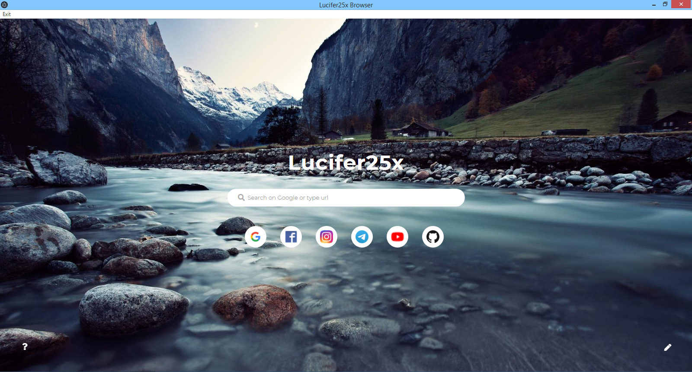

# Simple Browser using HTML,CSS,JS 
Bu project bekar olduqda, sınaq üçün düzəldilib. Projecti fork edib düzəlişlər edə, əlavələr edə bilərsiniz.

## Usage:
<br/>
<details>
  <summary>How to use?</summary>
  <ol>
    <li>For focus to input: press "/"</li>
    <li>For search: write anything on input</li>
    <li>For open website: write www.website.com or https://website.com</li>
  </ol>
</details>
<br/>
<details>
  <summary>Short Writings</summary>
  <ol>
    <li>Youtube: /yt</li>
    <li>Instagram: /insta</li>
    <li>Telegram: /tg</li>
    <li>Google: /google</li>
    <li>Facebook: /face</li>
    <li>WhatsApp: /wp</li>
    <li>Spotify: /spotify</li>
    <li>Netflix: /netflix</li>
  </ol>
</details>
<hr/>

Çalışdırmaq üçün:
```
npm start
```
Xəta verirsə:
```
npm install electron
```
Əgər .exe şəklində çalışdırmaq istəyirsinizsə electron-packager yükləyib package.json-da startda "electron ." yerinə "electron-packager ." yazın.
Electron-packager yükləmək üçün:
```
npm install electron-packager
```
<a href="https://t.me/lucifer25x1"></a>
